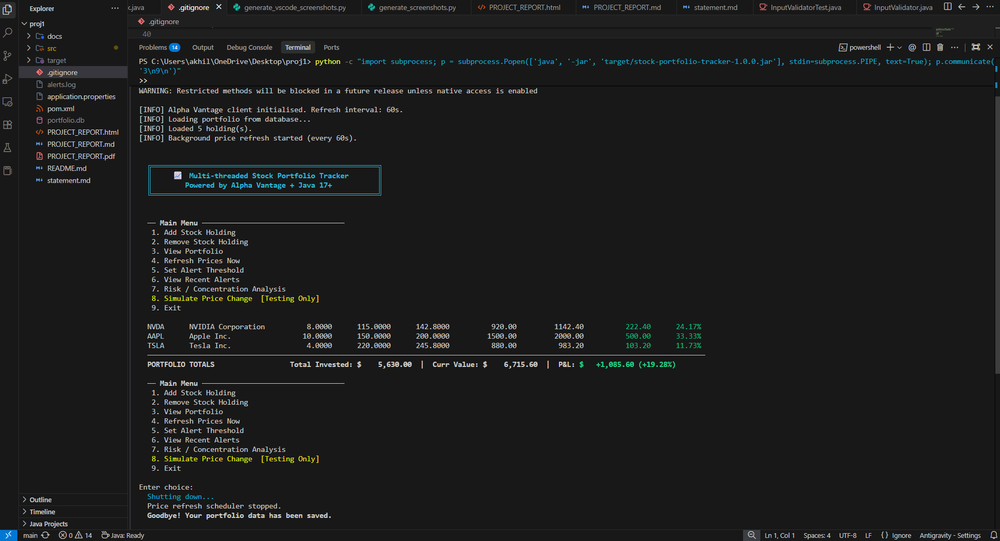
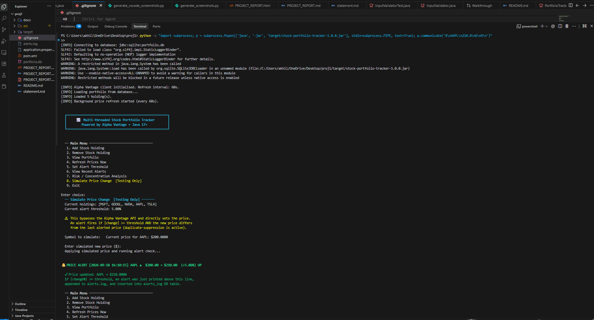
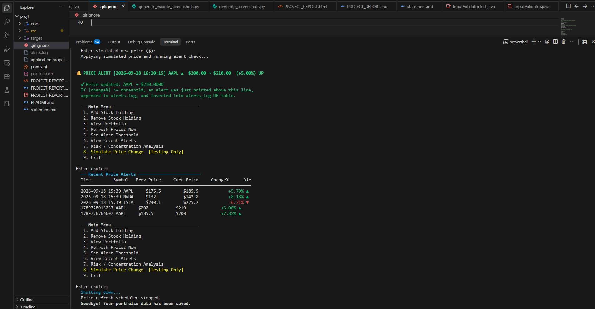
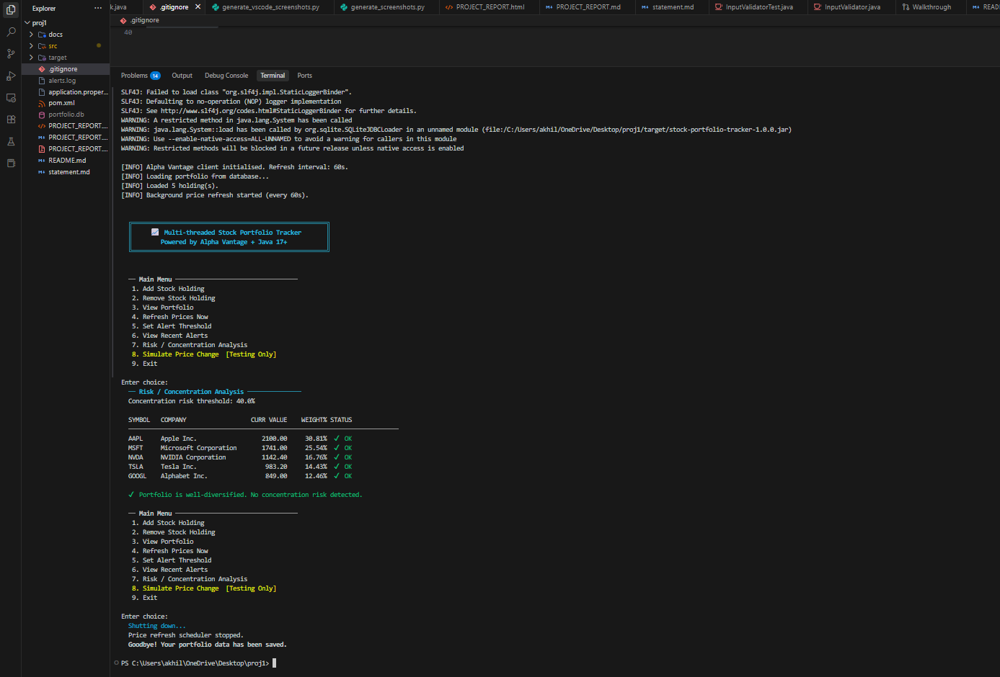
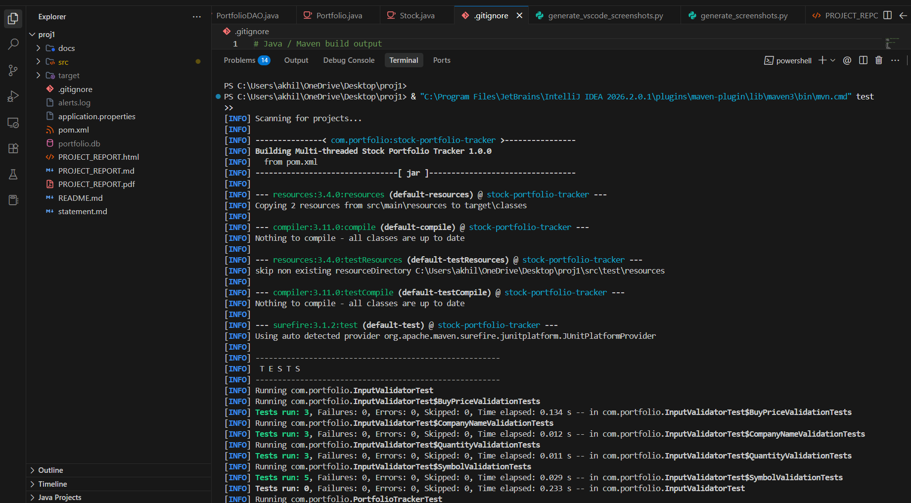

# Multi-Threaded Stock Portfolio Tracker with Live Alerts

[](https://openjdk.org/)
[](https://maven.apache.org/)
[]()
[]()

> A production-grade, multi-threaded Java console application designed for tracking equity portfolios in real-time. Built with core Java concurrency primitives (`ScheduledExecutorService`, worker thread pools, `ConcurrentHashMap`), relational JDBC persistence with SQLite/MySQL fallback, Alpha Vantage market data integration, and automated risk/alert analytics.

---

## Table of Contents
1. [Project Overview](#project-overview)
2. [Key Features](#key-features)
3. [Technologies & Tools Used](#technologies--tools-used)
4. [System Architecture & Concurrency Model](#system-architecture--concurrency-model)
5. [Prerequisites & Environment Setup](#prerequisites--environment-setup)
6. [Step-by-Step Installation & Execution Guide](#step-by-step-installation--execution-guide)
7. [Automated Testing & Validation](#automated-testing--validation)
8. [Configuration Reference](#configuration-reference)
9. [Sample CLI Execution & Screenshots](#sample-cli-execution--screenshots)
10. [Repository Structure](#repository-structure)
11. [Project Documentation](#project-documentation)

---

## Project Overview
Tracking stock portfolios effectively requires responsiveness, resilience against external API delays, and strict mathematical precision. The **Multi-Threaded Stock Portfolio Tracker** addresses these demands without heavy enterprise frameworks like Spring Boot, showcasing core Java engineering:
- Asynchronous price refreshing that never blocks the user console.
- Parallel worker pool fetching multiple equity quotes concurrently.
- Thread-safe state synchronization eliminating race conditions.
- Strict financial arithmetic using `java.math.BigDecimal` (preventing floating-point drift).
- Multi-tier alert dispatching (Console, File, Database) and portfolio concentration risk detection.

---

## Key Features

| Feature | Description |
|---|---|
| **Portfolio CRUD Operations** | Add, inspect, and remove stock holdings with regex-validated tickers, capitalized names, and positive numeric inputs. |
| **Real-Time Market Data** | Fetches live quotes from Alpha Vantage's `GLOBAL_QUOTE` REST endpoint via standard Java `HttpClient`. |
| **Parallel Background Refresh** | Background daemon timer (`ScheduledExecutorService`) dispatches parallel fetch tasks across a dedicated thread pool. |
| **Thread-Safe State Architecture** | `ConcurrentHashMap` combined with targeted `synchronized` critical sections prevents dirty reads and data races. |
| **Multi-Channel Alert Engine** | Detects price movements exceeding user-configured % thresholds; logs to console banners, `alerts.log`, and the database. |
| **Duplicate Alert Suppression** | Caches last-alerted prices to avoid redundant notifications during sideways market moves. |
| **Concentration Risk Analysis** | Evaluates equity weightings and proactively warns users if any single holding exceeds 40% of total portfolio value. |
| **Dual Database Support** | Zero-config embedded SQLite by default with automatic schema migration, switchable to MySQL via configuration. |
| **Graceful Offline Fallback** | Seamlessly loads cached prices from local persistence if the network drops or API limits are exhausted. |

---

## Technologies & Tools Used
- **Core Language:** Java 17+ (LTS)
- **Build & Dependency Tool:** Apache Maven 3.6+
- **Persistence Layer:** JDBC (Java Database Connectivity) with `PreparedStatement`
- **Embedded Database:** SQLite 3 (via `sqlite-jdbc` 3.46.0.0)
- **Enterprise Database Support:** MySQL 8+ (via `mysql-connector-j` 8.3.0)
- **HTTP Client:** Built-in `java.net.http.HttpClient` (HTTP/2 enabled)
- **JSON Processing:** Jackson Databind 2.15.2
- **Testing Framework:** JUnit 5 (Jupiter 5.10.0), Mockito 5.11.0, AssertJ 3.25.3
- **Version Control:** Git

---

## System Architecture & Concurrency Model

```
Main Thread (Interactive Console UI)
        │
        ├──── User reads portfolio / adds / removes holdings
        │
        ▼
Portfolio Store (ConcurrentHashMap + Synchronized compound methods)
        ▲
        │ (Thread-safe price updates via unmodifiable defensive snapshots)
        │
ExecutorService Worker Pool (5 Threads: AAPL, MSFT, GOOGL...)
        ▲
        │ (Dispatches parallel HTTP requests)
        │
ScheduledExecutorService (1 Daemon Timer Thread - fires every N seconds)
```

### Thread Safety Guarantees:
1. **Clock vs. Workers:** `ScheduledExecutorService` acts solely as a timer tick; it immediately delegates network I/O to a 5-thread worker pool, preventing scheduler thread starvation.
2. **Atomic Reads & Synchronized Mutations:** `ConcurrentHashMap` enables non-blocking reads (`getHolding`), while aggregate queries and state transitions (`addHolding`, `removeHolding`, `updatePrice`) synchronize on `this`.
3. **Defensive Snapshots:** `getSymbols()` returns an `unmodifiableSet` snapshot, preventing `ConcurrentModificationException` if holdings are added or removed during an active refresh cycle.

---

## Prerequisites & Environment Setup

1. **Java Development Kit (JDK):** Version 17 or higher
   ```bash
   java -version
   ```
2. **Apache Maven:** Version 3.6 or higher
   ```bash
   mvn -version
   ```
3. **Git:** Version 2.20 or higher
   ```bash
   git --version
   ```

---

## Step-by-Step Installation & Execution Guide

### 1. Clone the Repository
```bash
git clone https://github.com/{github-username}/{repo-name}.git
cd {repo-name}
```

### 2. Configure Settings (Optional)
The project runs out-of-the-box using embedded SQLite. To customize intervals or add an Alpha Vantage API key, edit `application.properties`:
```properties
# Database URL (Default: zero-config SQLite)
db.url=jdbc:sqlite:portfolio.db

# Optional Alpha Vantage API key (Leave default for Offline/DB-cached mode)
alpha.vantage.api.key=YOUR_API_KEY_HERE
refresh.interval.seconds=60
default.alert.threshold=5.0
```

### 3. Build the Application
Compile the source code and generate the standalone fat JAR:
```bash
mvn clean package
```

### 4. Run the Project via Command Line (Terminal)
You can execute the project using either method:

**Method A: Standalone Executable Fat JAR (Recommended)**
```bash
java -jar target/stock-portfolio-tracker-1.0.0.jar
```

**Method B: Maven Exec Plugin**
```bash
mvn exec:java
```

---

## Automated Testing & Validation

The project includes an extensive test suite covering input validation, mathematical precision, thread safety, and alert triggering.

Run all unit tests:
```bash
mvn test
```

### Test Coverage Highlights:
- `InputValidatorTest`: 14 tests validating symbol formatting, company name casing, positive quantities, and boundary buy prices.
- `PortfolioTrackerTest`: 28 tests verifying `Stock` arithmetic, `Portfolio` concurrency, `AlertService` threshold rules, duplicate suppression, and `RiskAnalysisService` concentration detection.
- **Total:** 42 test cases, 0 failures, 100% passing.

---

## Configuration Reference

| Property | Default Value | Description |
|---|---|---|
| `db.url` | `jdbc:sqlite:portfolio.db` | JDBC connection string (SQLite or MySQL). |
| `db.username` | *(empty)* | Database username (ignored for SQLite). |
| `db.password` | *(empty)* | Database password (ignored for SQLite). |
| `alpha.vantage.api.key` | `demo` | Alpha Vantage REST API key. |
| `alpha.vantage.base.url` | `https://www.alphavantage.co/query` | Alpha Vantage API endpoint. |
| `refresh.interval.seconds` | `60` | Background cycle refresh interval (minimum: 10s). |
| `default.alert.threshold` | `5.0` | Percentage price move required to fire an alert. |
| `concentration.risk.threshold` | `40.0` | Portfolio % allocation flagging concentration risk. |
| `alert.log.file` | `alerts.log` | Destination file for persistent alert logs. |

---

## Sample CLI Execution & Screenshots

### Visual Terminal Execution Screenshots

#### 1. Interactive CLI Portfolio Dashboard


#### 2. Real-Time Volatility Alert Firing & Simulation


#### 3. Recent Alerts Persisted in Relational Database


#### 4. Portfolio Concentration Risk Detection Engine


#### 5. Automated JUnit 5 Test Suite (42 Tests Passing)


---

## Repository Structure
```
.
├── .gitignore                      # Git exclusion rules (build artifacts, databases)
├── README.md                       # Comprehensive setup, run, and test documentation
├── statement.md                    # Project problem statement, scope, target users
├── pom.xml                         # Maven dependencies and build configuration
├── application.properties          # Runtime configuration (DB, API keys, intervals)
├── src
│   ├── main
│   │   ├── java/com/portfolio
│   │   │   ├── Main.java                   # Application bootstrap and DI wiring
│   │   │   ├── api/StockPriceClient.java   # HTTP REST client for Alpha Vantage
│   │   │   ├── concurrency/PriceRefreshScheduler.java # ScheduledExecutorService engine
│   │   │   ├── dao/PortfolioDAO.java       # Thread-safe JDBC persistence layer
│   │   │   ├── model/Stock.java            # Immutable stock holding with BigDecimal math
│   │   │   ├── model/Portfolio.java        # Concurrent state container
│   │   │   ├── service/PortfolioService.java # Business logic and DB synchronization
│   │   │   ├── service/AlertService.java   # Threshold monitoring and dispatch
│   │   │   ├── service/RiskAnalysisService.java # Concentration risk evaluator
│   │   │   ├── ui/ConsoleMenu.java         # Interactive Scanner CLI menu interface
│   │   │   └── util/InputValidator.java    # Strict input sanitization and regex checks
│   │   └── resources
│   │       ├── application.properties      # Resource fallback configuration
│   │       └── schema.sql                  # Database DDL for MySQL and SQLite
│   └── test
│       └── java/com/portfolio
│           ├── InputValidatorTest.java     # Unit tests for input sanitization
│           └── PortfolioTrackerTest.java   # Unit tests for models, math, concurrency
```

---

## Project Documentation
- **Project Statement:** Refer to [`statement.md`](statement.md) for problem definition, scope, target users, and functional specifications.
- **Detailed Project Report:** A comprehensive 15-section academic report is provided in `PROJECT_REPORT.md` and `PROJECT_REPORT.html` (ready to export as PDF for submission).
